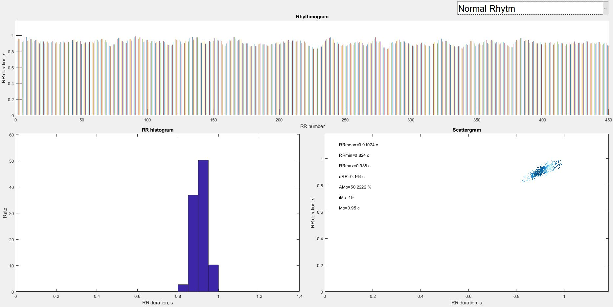
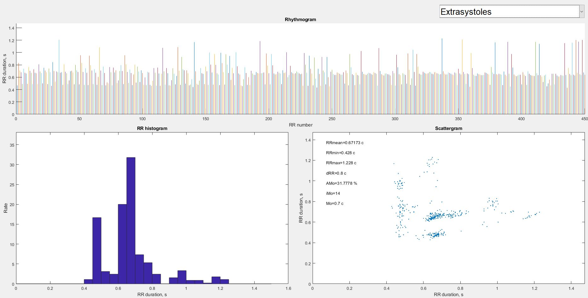
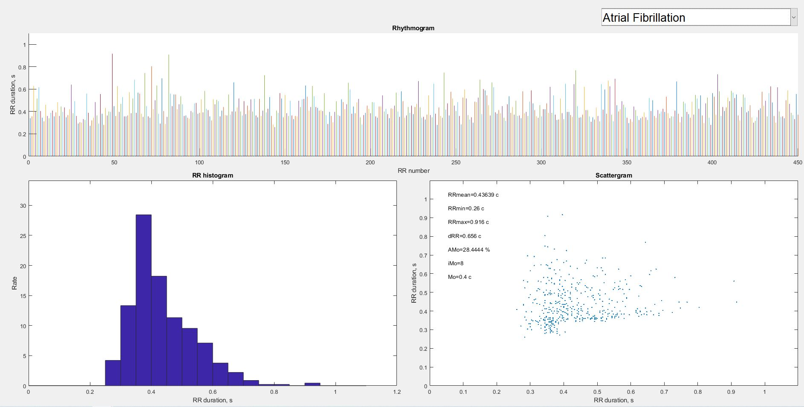
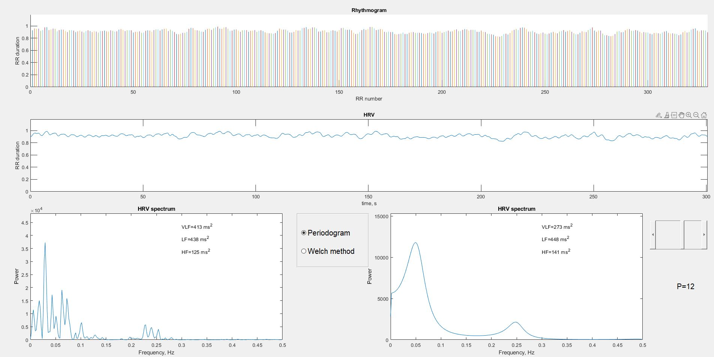

# HRV Processing

## About repository

<b>HRV Processing</b> contains different methods for processing heart rate variability using MATLAB.

The following processing procedures are presented:

 - [Rhythmogram analysis](#rhythmogram-analysis) 
 - [HRV analysis](#hrv-analysis)

## Rhythmogram analysis

The loaded rhythmogram signal contains sequences of RR interval durations for three heart rhythms (normal, extrasystoles and atrial fibrilation).

To illustrate the difference between classes, a program was developed to display a rhythmogram, a histogram, and a scattergram of RR interval distribution. The main significant statistical indices such as mean, range, mode and its amplitude were also calculated

Screenshots of the program are shown in the figures below:

## HRV analysis

For HRV analysis, the rhythmogram was transformed into a function of change in RR interval duration from time with a given descriptive frequency of 4 Hz.

Using spectral analysis, HRV spectra were calculated and the power of rhythms limited by known frequency ranges was calculated.

To illustrate the dependence of the result on the chosen method of spectrum construction, the program offers the periodogram, Welch and autoregressive methods. For the AR model, the possibility of selecting the order of the model is implemented.

The results are shown in the figure below:

